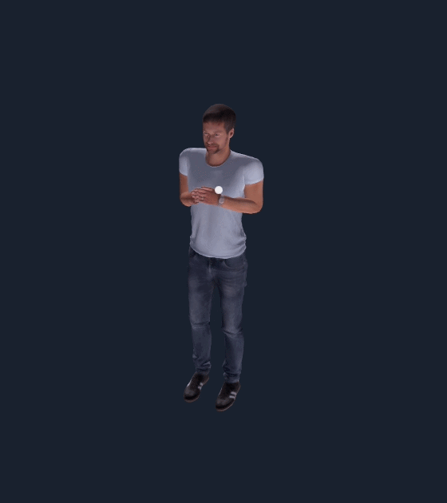
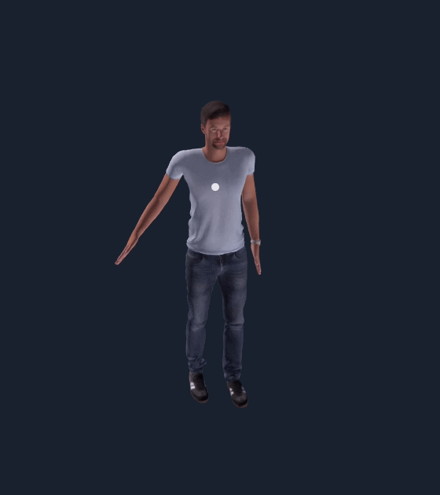
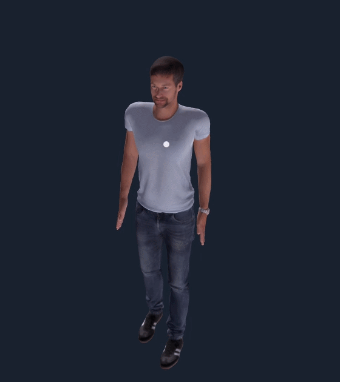
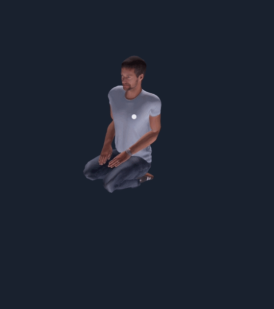
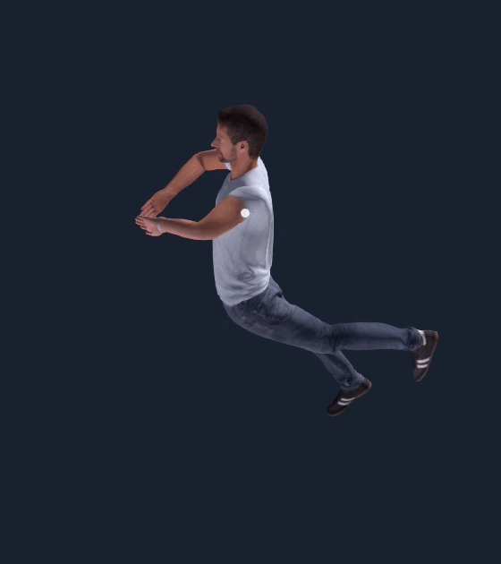

# N8RO Character Plugin - FURKAN ERHAN 230201015

## 🚀 Project Overview

This project implements a closed-library, pure C++ procedural animation controller for the N8RO SDK. It completely overrides the default animation state machine to directly compute and dictate local joint rotations for exactly **10 major degrees of freedom (DOF)**. 

Rather than relying on pre-baked keyframes or computationally expensive rigid-body dynamics, this solution uses **pure kinematic mathematics, dynamic phase accumulation, and exponential decay smoothing** to generate highly responsive, biologically accurate human locomotion.


https://github.com/user-attachments/assets/6df4acee-039d-470b-8da4-dce4b21b422c


> 🎬 **[Click here to watch the full Video Demonstration (All States)](/videos/All%20States.mp4)**

---

## 📋 Submission Summary (TL;DR) 
*As per the submission guidelines, below is the explicit list of implemented motion states and controlled joints.*

**Implemented Motion States (11):**
* **Walk:** Procedural gait cycle with synchronized arm swings.
* **Run:** Aerodynamic running posture with Gimbal-Lock corrected arm kinematics.
* **Jump:** Deep-squat kinematic sequence with smoothed exponential decay.
* **Crawl:** Horizontal low-profile state with extended limbs.
* **Clap:** Rhythmic bouncing with dynamic X-axis center-chest collision.
* **Wave:** Friendly, isolated arm swinging with subtle natural body sway.
* **Sit Crossed:** Asymmetric skeletal locking to simulate a mid-air seated posture.
* **Kick:** Multi-phase kinetic chain separating lift momentum from snap-kick release.
* **Kneel:** Rapid Z-axis knee compression and momentum shifting.
* **Swim:** Deep squat transitioning to a fluid upward thrust.
* **Idle:** Dynamic anatomical breathing simulation.

**Strictly Controlled Joints (10):**
The mathematical model bypasses default animations and actively dictates the local rotations for exactly 10 joints (spine and head remain untouched):
`leftHip`, `rightHip`, `leftKnee`, `rightKnee`, `leftAnkle`, `rightAnkle`, `leftShoulder`, `rightShoulder`, `leftElbow`, `rightElbow`.

---

## ⚡ Quick Start (Ready-to-Use)
You do not need to build the project to test it. A pre-compiled release DLL is included.

1. Navigate to the `plugin/` directory in this repository.
2. Copy `student-char-anim.dll`.
3. Paste it directly into your N8RO installation path:
   👉 `C:\N8RO\userPlugins\sim\`
4. Launch N8RO, open the GLB Viewer, and use the keyboard inputs below!

**Keyboard Buttons -> `1 2 3 4 5 6 7 8 9 0`**
*(Example: Hold down button '1' for 'Walk' state)*

---

## 🧠 Implemented Motion States & Biomechanics

The state machine is dynamically controlled via keyboard inputs. Below are the procedural mathematical behaviors of the character based on active states.

<table>
  <tr>
    <td align="center">
      <b>1. Walk [KEY: 1]</b><br>
      <i>Procedural gait cycle with synchronized, out-of-phase arm swings and accurate ground clearance.</i><br>
      
    </td>
    <td align="center">
      <b>2. Run [KEY: 2]</b><br>
      <i>6.5Hz locomotion state. Forces deeper knee retractions and aggressively bends elbows inward.</i><br>
      
    </td>
  </tr>
  <tr>
    <td align="center">
      <b>3. Jump [KEY: 3]</b><br>
      <i>Deep-squat vertical loading with mathematically adjusted exponential decay (smooth factor 4.0).</i><br>
      
    </td>
    <td align="center">
      <b>4. Crawl [KEY: 4]</b><br>
      <i>Horizontal low-profile locomotion state utilizing broken elbow/knee Z-axis manipulations.</i><br>
      
    </td>
  </tr>
  <tr>
    <td align="center">
      <b>5. Clap [KEY: 5]</b><br>
      <i>Dynamic X-axis collision at the center-chest combined with procedural jump-bouncing.</i><br>
      
    </td>
    <td align="center">
      <b>6. Wave [KEY: 6]</b><br>
      <i>High-frequency isolated arm oscillation coupled with a micro-sway body offset.</i><br>
      
    </td>
  </tr>
  <tr>
    <td align="center">
      <b>7. Sit Crossed [KEY: 7]</b><br>
      <i>"Invisible chair" stance achieved by asymmetric leg crossing and relaxed arm resting.</i><br>
      
    </td>
    <td align="center">
      <b>8. Kick [KEY: 8]</b><br>
      <i>Bicycle kick simulation separating lift-momentum from the final zero-degree snap-kick.</i><br>
      
    </td>
  </tr>
  <tr>
    <td align="center">
      <b>9. Kneel [KEY: 9]</b><br>
      <i>Aggressive drop into a strike/kneeling posture, simulating heavy upper-body momentum.</i><br>
      
    </td>
    <td align="center">
      <b>0. Swim [KEY: 0]</b><br>
      <i>Fluid kinetic transfer from a deep squat into a synchronized upward upper-body thrust.</i><br>
      
    </td>
  </tr>
  <tr>
    <td align="center" colspan="2">
      <b>Default. Idle (Breathing)</b><br>
      <i>Instead of a frozen static posture, a subtle sine-wave offset simulates anatomical breathing.</i><br>
      
    </td>
  </tr>
</table>
---

## 📐 Controlled Joints (Strictly 10 DOF)

In strict adherence to the project requirements, the algorithm outputs active `local_rotation` overrides for the following 10 human joints ONLY. The spine and head remain untouched.

* `leftHip` & `rightHip`
* `leftKnee` & `rightKnee`
* `leftAnkle` & `rightAnkle`
* `leftShoulder` & `rightShoulder`
* `leftElbow` & `rightElbow`

---

## ⚙️ Architecture & Design Rationale

**Phase Accumulation over Time-Scaling:** A common pitfall in procedural animation is multiplying the simulation time directly by the speed scale, which causes severe "teleportation" or phase-jumping bugs when transitioning between states (e.g., from Walk to Run). 

This engine solves this by utilizing a **Time-based Phase Accumulator**:

```cpp
// Integrating phase over delta time prevents wave discontinuity
state.joints["phase_acc"].x += dt * freq * speedScale;
double cycle = state.joints["phase_acc"].x;
```
- This ensures perfectly smooth sinusoidal transitions between all locomotion states without breaking the continuous sine wave.

### Gimbal Lock (Euler Angle) Evasion:
- During complex shoulder movements (like the running gait), approaching a 90-degree Yaw (Y axis) causes traditional Pitch (Z axis) waves to result in bone-rolling (Gimbal Lock). The math in this plugin dynamically re-assigns the sinusoidal swing to the correct hinge axis based on the shoulder's locked orientation, resulting in absolute mechanical stability.

## 🛠️ Build Instructions
This repository provides a direct, low-level compilation approach using the native Microsoft Visual C++ Compiler (`cl.exe`), eliminating the need for intermediate build generators like CMake. You can compile the project using either the automated batch script or the Visual Studio IDE.

**Option A: Automated Native Build (Recommended)**
The provided `build.bat` script automatically initializes the MSVC environment, compiles the source code with `/O2` (maximum speed) optimization, links the required N8RO SDK libraries, and outputs the final DLL directly into the engine's plugin directory.

1. Open the Developer Command Prompt for Visual Studio.
2. Navigate to the repository root directory.
3. Execute the script:
```cmd
   build.bat
```
**Note** : You can also directly execute the *build.bat* file and it will do the build. Also ensure your N8RO installation is located at C:\N8RO\ as targeted by the script paths 

### Option B: Using Visual Studio (`.slnx` / `.vcxproj`)

1. Open `sim-char-anim-custom-model.slnx` or `student-char-anim.vcxproj` in Visual Studio.
    
2. Set the build configuration to **Release / x64**.
    
3. Build the solution (`Ctrl + Shift + B`).
    

_Developed by Furkan Erhan._
