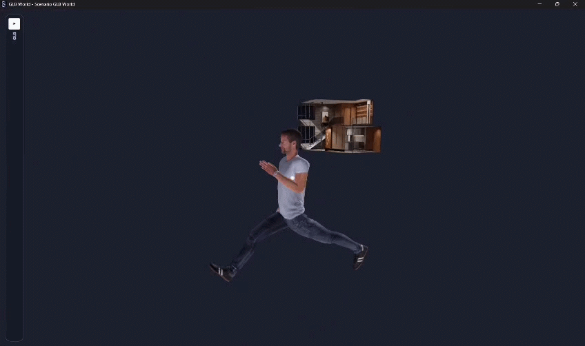
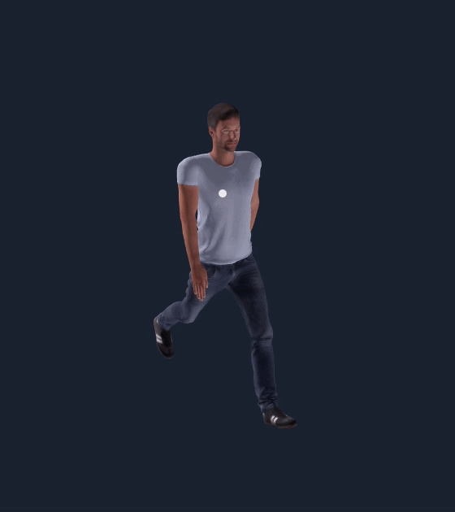
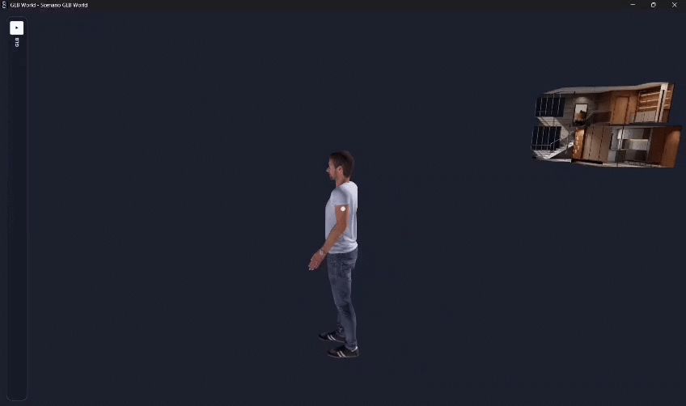
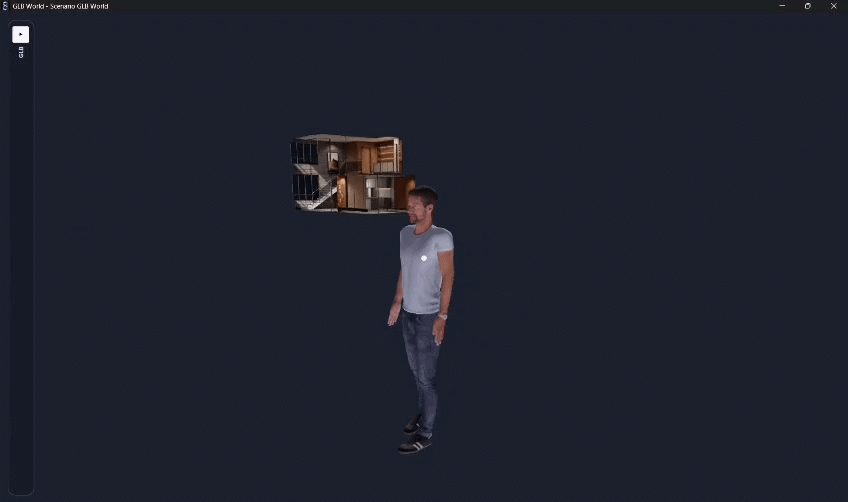

# N8RO Character Plugin - FURKAN ERHAN 230201015

## 🚀 Project Overview

This project implements a closed-library, pure C++ procedural animation controller for the N8RO SDK. It completely overrides the default animation state machine to directly compute and dictate local joint rotations for exactly **10 major degrees of freedom (DOF)**. 

Rather than relying on pre-baked keyframes or computationally expensive rigid-body dynamics, this solution uses **pure kinematic mathematics, dynamic phase accumulation, and exponential decay smoothing** to generate highly responsive, biologically accurate human locomotion.


<div align="center"> <a href="videos/all.mp4">  </a> <p><b>A high-fidelity C++ procedural simulation plugin for the Arkheon/N8RO environment.</b></p> <p><i>🎬 Click the image above to watch the full video demonstration of all states.</i></p> </div>

> 🎬 **[Click here to watch the full Video Demonstration (All States)](videos/all.mp4)**

---

## 📋 Submission Summary (TL;DR) 
*As per the submission guidelines, below is the explicit list of implemented motion states and controlled joints.*

**Implemented Motion States (5):**
1. **Walk:** Procedural gait cycle with synchronized arm swings.
2. **Run:** Amplified locomotion with increased stride and deep knee retractions.
3. **Jump:** Deep-squat kinematic sequence with smoothed exponential decay.
4. **Crawl:** Horizontal low-profile state with extended limbs.
5. **Idle (Breathing):** Dynamic anatomical breathing simulation.

**Strictly Controlled Joints (10):**
The mathematical model bypasses default animations and actively dictates the local rotations for exactly 10 joints (spine and head remain untouched):
`leftHip`, `rightHip`, `leftKnee`, `rightKnee`, `leftAnkle`, `rightAnkle`, `leftShoulder`, `rightShoulder`, `leftElbow`, `rightElbow`.

---

## ⚡ Quick Start (Ready-to-Use)

You do not need to build the project to test it. A pre-compiled release DLL is included.

1. Navigate to the `plugin/` directory in this repository.
2. Copy `student-char-anim.dll`.
3. Paste it directly into your N8RO installation path:
   👉 `C:\N8RO\userPlugins\sim\`
4. Launch N8RO, open the GLB Viewer, and use the keyboard inputs below!
- ==Keyboard Buttons -> "1 2 3 4 5"==
- Example : Hold down button '**1**' for '**walk**' state

---

## 🧠 Implemented Motion States & Biomechanics

The state machine is dynamically controlled via keyboard inputs (**1, 2, 3, 4, 5** for state selection).


### 1. Walk `[KEY: 1]`
A procedural gait cycle driven by a `4.0Hz` phase accumulator. It features synchronized, out-of-phase arm swings (counter-pendulum logic) and biomechanically accurate knee retractions to ensure ground clearance.


### 2. Run `[KEY: 2]`
An amplified `6.5Hz` locomotion state. The algorithm procedurally increases the stride length (hip extension), forces deeper knee retractions, and dynamically bends the elbows inward for an aggressive, aerodynamic running posture.


### 3. Jump `[KEY: 3]`
A specialized deep-squat and launch kinematic sequence. It uses a mathematically adjusted exponential decay (smooth factor `4.0`) to simulate cinematic vertical loading, joint compression, and energy release.


### 4. Crawl `[KEY: 4]`
A highly customized, horizontal low-profile locomotion state. The model extends the limbs outward, utilizing broken elbow/knee Z-axis manipulations to simulate a military commando crawl.


### 5. Idle (Breathing) `[KEY: 5] - Default`
Instead of a static "frozen" posture, the character dynamically simulates anatomical breathing. This is achieved via a synchronized sine wave offset applied to the shoulders, elbows, and knees, organically shifting the center of mass.


---

## 📐 Controlled Joints (Strictly 10 DOF)

In strict adherence to the project requirements, the algorithm outputs active `local_rotation` overrides for the following 10 human joints ONLY. The spine and head remain untouched.

* `leftHip` & `rightHip`
* `leftKnee` & `rightKnee`
* `leftAnkle` & `rightAnkle`
* `leftShoulder` & `rightShoulder`
* `leftElbow` & `rightElbow`

---

## ⚙️ Architecture & Design Rationale

**Phase Accumulation over Time-Scaling:** A common pitfall in procedural animation is multiplying the simulation time directly by the speed scale, which causes severe "teleportation" or phase-jumping bugs when transitioning between states (e.g., from Walk to Run). 

This engine solves this by utilizing a **Time-based Phase Accumulator**:

```cpp
// Integrating phase over delta time prevents wave discontinuity
state.joints["phase_acc"].x += dt * freq * speedScale;
double cycle = state.joints["phase_acc"].x;
```
- This ensures perfectly smooth sinusoidal transitions between all locomotion states without breaking the continuous sine wave.
## 🛠️ Build Instructions

This repository provides multiple ways to compile the source code, supporting both CMake and native Visual Studio MSBuild environments.

### Option A: Using CMake (Recommended)

1. Open the Developer Command Prompt for Visual Studio.
    
2. Navigate to the repository root.
    
3. Generate build files: `cmake -S . -B build -A x64`
    
4. Compile the Release DLL: `cmake --build build --config Release`


### Option B: Using Visual Studio (`.slnx` / `.vcxproj`)

1. Open `sim-char-anim-custom-model.slnx` or `student-char-anim.vcxproj` in Visual Studio 2026+.
    
2. Set the build configuration to **Release / x64**.
    
3. Build the solution (`Ctrl + Shift + B`).
    
4. Alternatively, you can run the provided `build.bat` script for a quick automated build.


_Developed by Furkan Erhan._
